# 斯里兰卡生态服务价值计算

---

## 一、引言

生态系统服务价值是指人类**间接**或**直接**从生态系统各服务功能中获得的**收益**，对人类社会福祉起着极其重要的贡献。生态系统服务价值核算作为一项**基础性研究工作**，对生态安全格局的构建、生态补偿以及生态文明建设等研究有重要的参考价值，对促进人与自然和谐共生以及人类自己的可持续发展有重要意义(熊睿毅，2021)。

联合国生态评估组将生态系统服务分为四类：

- 供给服务
  - 供给服务主要是提供人类生存生活所必须的物质资源，譬如食物、水资源、原材料等
- 调节服务
  - 调节服务是指生态系统在发挥维持自我稳定和自我修复的特性时提供的服务，主要包括水文调节、气体调节、气候调节、净化环境等功能
- 支持服务
  - 支持服务是指作为其他服务的基础，起到支持和维持作用的服务，譬如土壤保持、生物多样性保持和养分循环维持等
- 文化服务
  - 文化服务是指为人类提供的满足人类文化兴趣和需求的服务，譬如灵感获取、宗教服务、精神价值、教育价值等，其最大的特点就是非消耗性，不受到消费而减少。

本文采用模拟市场法进行价值评估，细化方法为当量因子法，国内主流的是谢高地在Costanza的研究基础上进行改良后的适用于中国陆地生态系统的单位面积价值当量因子动态评估模型，其单位面积生态系统服务价值当量表如下：

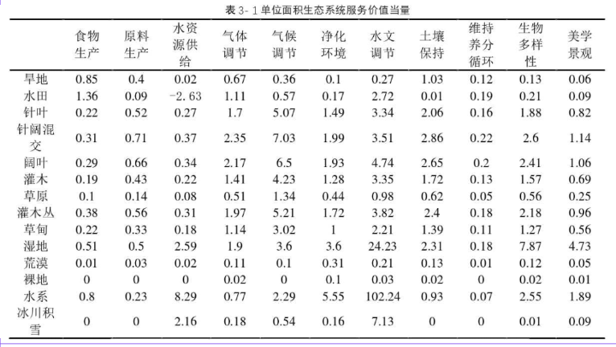

<center>单位面积生态系统服务价值当量</center>

生态系统服务价值量的计算公式如下：
$$
ESV=\sum_{m=1}^xA_m\sum_{n=1}^yE_{mn}
$$
其中，$m$为第$m$类生态系统，$n$为第$n$个服务功能，$A_m$为研究范围内第$m$个生态系统的面积，$E_{mn}$则是该服务功能的标准单位价值。

标准单位$ESV$当量因子的价值公式为：
$$
V=1/7\times P\times Q
$$
其中，$P$表示粮食均价，$Q$表示粮食单产。

---

## 二、数据源

土地覆盖数据来自于Esri公司的Sentinel-2 Land Cover Explorer产品，网址为：https://livingatlas.arcgis.com/landcoverexplorer/#mapCenter=-66.80083417615404%2C-9.321964396201427%2C11&mode=step&timeExtent=2017%2C2022&year=2022。该产品提供了哨兵二号获取的2017-2020年10m分辨率的全球土地覆盖类型数据，一共有九类，包括水系、森林、湿地、耕地、建筑用地、裸地、冰雪、云层、草甸。

行政区划数据来自于GADM官网，该数据集提供了全球所有国家及其下级行政区划的矢量边界和空间数据，网址为：https://gadm.org/index.html。值得注意的，这里的中国数据并没有台湾和九段线，不建议在这里下载精确的国家数据。

统计年鉴数据，包括主要农作物产量、单价，来自于国际粮农组织，官网为：https://www.fao.org/faostat/en/#data

---

## 三、数据处理

### 3.1 数据预处理

#### 3.1.1 土地覆盖类型数据处理

在Esri上下载的土地覆盖类型数据，每一年都有两幅图像，如下图所示，我们需要做的就是将其拼接起来，并通过斯里兰卡矢量边界进行裁剪。

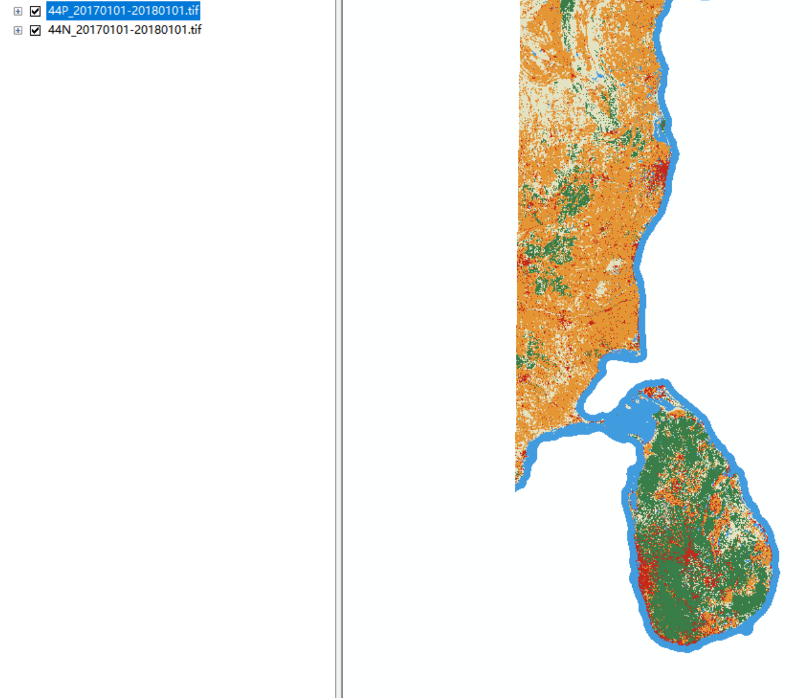

<center>土地覆盖数据


</center>

其中，`镶嵌至新栅格`在工具箱中的位置如下：数据管理->栅格->栅格数据集->镶嵌至新栅格

`裁剪`在工具箱中的位置如下：数据管理->栅格->栅格处理->裁剪

新建一个个人地理数据库，并将下载的`2017-2022`年数据处理好后保存到该数据库。

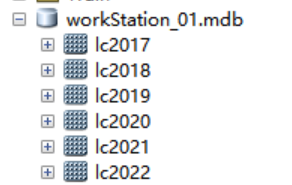

<center>工作数据库


裁剪完之后，数据分类值域会自动填充至[0,255]，这并不是我们想要的，因此，通过栅格计算器工具处理掉不需要的值。

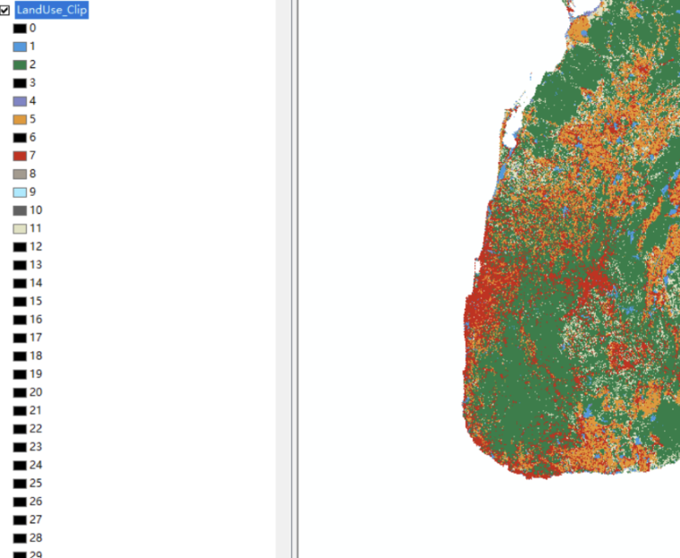

<center>异常数据


`栅格计算器`工具位于空间分析工具->地图代数->栅格计算器，计算表达式为：`Con("lc2021">11,0,"lc2021")`，该条件语句将大于11的值映射至0，而小于11的保持原状。

#### 3.1.2 产量、价格数据处理

我们读取数据，并进行简单的统计量查看。

```python
import pandas as pd

path=r"Path"
yield_=pd.read_csv(path+r"\yield.csv")
pp_=pd.read_csv(path+r"\Producer Prices.csv")
yield_.head()
```

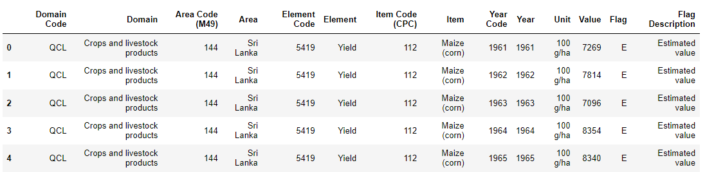

<center>产量数据


需要用到的属性只有`Item,Year,Unit,Value`,为了保证数据的时效性，我们只使用2000年以后的数据。因此需要对原始数据做时间和属性上的筛选。

```python
yield_=yield_[["Item","Year","Unit","Value"]]
yield_=yield_[yield_["Year"]>2000]

# 对于价格数据同理
pp_=pp_[["Item","Year","Value","Element"]]
pp_=pp_[pp_["Year"]>2000]
```

实际上，在这个数据里，产量已经没有问题了。我们只需要做一个简单的处理：

```python
yield_.groupby("Item").mean()["Value"]/10 #转为千克
```

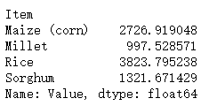

<center>平均产量


便可拿到每种作物近二十年的平均产量(单位：千克/公顷)。

---

### 3.2 基于LSTM的简单时间序列数据扩充

从世界粮农组织获得Sri Lanka主要农作物产量和价格数据时，其中的主要作物Sorghum仅有2001-2006年的数据，而Millet只有2001-2005,2020-2021这样的间断数据。虽然说可以直接剔除这种过分缺失的数据，但这无疑会对生态因子的计算造成重大影响。为了尽可能保证数据的稳定，我们采用循环神经网络来对数据进行拟合扩充。

#### 3.2.1 数据探查

在上一小节，我们读入了产量和价格数据。实际上，这个价格数据是有问题的。

```python
pp_.tail(10)
```

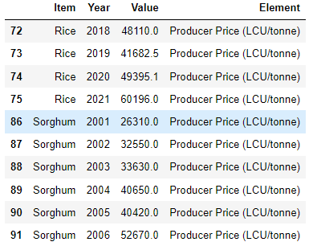

<center>产量数据


高粱数据最新只到2006年。

#### 3.2.2 模型构建

在本小节，我们将比较传统一维CNN与RNN在结果上的异同。

一般做一维RNN时，可以指定一个`时间窗口`，比如用`2006,2007,2008`年的数据，推理`2009`年的数据，用`2007,2008,2009`年推理`2010`年。

我们现在要用之前处理好的`pp_c`数据中的玉米产量，来预测高粱产量。所以第一步就是将其转化为`torch`接受的格式。

别忘记导入模块：

```python
import torch
import torch.nn as nn
from torch.nn import functional as F
```

```python
x=pp_c[pp_c['Item']=="Maize (corn)"]['Value']
x=torch.FloatTensor(x)
```

之前写数据迭代器的时候，除了可以继承自`torch.utils.data.DataLoader`，也可以是任意的可迭代对象。这里我们可以简单的设置一个类：

```python
# 设置迭代器
class MyDataSet(object):
    def __init__(self,seq,ws=6):
        # ws是滑动窗口大小
        self.ori=[i for i in seq[:ws]]
        self.label=[i for i in seq[ws:]]
        self.reset()
        self.ws=ws

    def set(self,dpi):
        # 添加数据
        self.x.append(dpi)
        
    def reset(self):
        # 初始化
        self.x=self.ori[:]
        
    def get(self,idx):
        return self.x[idx:idx+self.ws],self.label[idx]
    
    def __len__(self):
        return len(self.x)
```

在对数据按照时间窗口进行处理时，主要有两种方式，一种是用原始数据做预测，一种是用预测数据做预测。

假设$A=[a1,a2,a3,a4,a5,a6]$，时间窗口大小为3。

用原始数据做预测，那么输入值为：$a1,a2,a3$，得到的结果将与$a4$做比较。下一轮输入为$a2,a3,a4$，得到的结果将与$a5$做比较。

而用预测的数据做预测，第一轮输入值为$a1,a2,a3$，得到的结果是$b4$，在与$a4$做比较后，下一轮的输入为$a2,a3,b4$，会出现如下情况：

输入数据为$b4,b5,b6$。

```python
ws=6 # 全局时间窗口
train_data=MyDataSet(x,ws)
```

网络的架构如下：

```python
   
class Net3(nn.Module):
    def __init__(self,in_features=54,n_hidden1=128,n_hidden2=256,n_hidden3=512,out_features=7):
        super(Net3, self).__init__()
        self.flatten=nn.Flatten()
        self.hidden1=nn.Sequential(
            nn.Linear(in_features,n_hidden1,False),
           
            nn.ReLU()
        )
        self.hidden2=nn.Sequential(
            nn.Linear(n_hidden1,n_hidden2),

            nn.ReLU()
        )
        self.hidden3=nn.Sequential(
            nn.Linear(n_hidden2,n_hidden3),

            nn.ReLU()
        )
        self.out=nn.Sequential(nn.Linear(n_hidden3,out_features))

    def forward(self,x):
        x=self.flatten(x)
        x=self.hidden2(self.hidden1(x))
        x=self.hidden3(x)
        return self.out(x)


class CNN(nn.Module):
    def __init__(self, output_dim=1,ws=6):
        super(CNN, self).__init__()
        self.relu = nn.ReLU(inplace=True)
        self.conv1 = nn.Conv1d(ws, 64, 1)
        self.lr = nn.LeakyReLU(inplace=True)
        self.conv2 = nn.Conv1d(64, 128, 1)

        self.bn1, self.bn2 = nn.BatchNorm1d(64), nn.BatchNorm1d(128)
        self.bn3, self.bn4 = nn.BatchNorm1d(1024), nn.BatchNorm1d(128)
        self.flatten = nn.Flatten()
        self.lstm1 = nn.LSTM(128, 1024)
        self.lstm2 = nn.LSTM(1024, 256)
        self.lstm3=nn.LSTM(256,512)
        self.fc = nn.Linear(512, 512)
        self.fc4=nn.Linear(512,256)
        self.fc1 = nn.Linear(256, 64)
        self.fc3 = nn.Linear(64, output_dim)

    @staticmethod
    def reS(x):
        return x.reshape(-1, x.shape[-1], x.shape[-2])

    def forward(self, x):
        x = self.reS(x)
        x = self.conv1(x) 
        x = self.lr(x)

        x = self.conv2(x) 
        x = self.lr(x)

        x = self.flatten(x)

        # LSTM部分
        x, h = self.lstm1(x)
        x, h = self.lstm2(x)
        x,h=self.lstm3(x)
        x, _ = h

        x = self.fc(x.reshape(-1, ))
        x = self.relu(x)
        x = self.fc4(x)
        x = self.relu(x)
        x = self.fc1(x)
        x = self.relu(x)
        x = self.fc3(x)

        return x

```

训练部分

```python
def Train(model,train_data,seed=1):
    device="cuda" if torch.cuda.is_available() else "cpu"
    model=model.to(device)
    Mloss=100000
    path=r"YourPath\%s.pth"%seed
    # 设置损失函数,这里使用的是均方误差损失
    criterion = nn.MSELoss()
    # 设置优化函数和学习率lr
    optimizer=torch.optim.Adam(model.parameters(),lr=1e-5,betas=(0.9,0.99),
                               eps=1e-07,weight_decay=0)
    # 设置训练周期
    epochs =3000
    criterion=criterion.to(device)
    model.train()
    for epoch in range(epochs):
        total_loss=0

        for i in range(len(x)-ws):
            # 每次更新参数前都梯度归零和初始化
            seq,y_train=train_data.get(i) # 从我们的数据集中拿出数据
            seq,y_train=torch.FloatTensor(seq),torch.FloatTensor([y_train])
            seq=seq.unsqueeze(dim=0)
            seq,y_train=seq.to(device),y_train.to(device)

            optimizer.zero_grad()
            # 注意这里要对样本进行reshape，
            # 转换成conv1d的input size（batch size, channel, series length）
            y_pred = model(seq)
            loss = criterion(y_pred, y_train)
            loss.backward()
            train_data.set(y_pred.to("cpu").item()) # 再放入预测数据
            optimizer.step()
            total_loss+=loss

        train_data.reset()
        if total_loss.tolist()<Mloss:
            Mloss=total_loss.tolist()
            torch.save(model.state_dict(),path)
            print("Saving")
        print(f'Epoch: {epoch+1:2} Mean Loss: {total_loss.tolist()/len(train_data):10.8f}')
    return model
```

```python
d=CNN(ws=ws)
Train(d,train_data,"Net1")
```

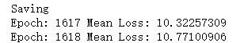

<center>模型损失


平均损失在10点左右。

```python
checkpoint=torch.load(r"YourPath\4.pth")
d.load_state_dict(checkpoint) # 加载最佳参数
d.to("cpu")
```

#### 3.2.3 结果可视化

我们这里用到`Pyechart`进行可视化。

```python
from pyecharts.charts import *
from pyecharts import options as opts
from pyecharts.globals import CurrentConfig
```

```python
pre,ppre=[i.item() for i in x[:ws]],[]
# pre 是用原始数据做预测
# ppre 用预测数据做预测
for i in range(len(x)-ws+1):
    ppre.append(d(torch.FloatTensor(x[i:i+ws]).unsqueeze(dim=0)))
    pre.append(d(torch.FloatTensor(pre[-ws:]).unsqueeze(dim=0)).item())
```

```py
l=Line()
l.add_xaxis([i for i in range(len(x))])
l.add_yaxis("Original Data",x.tolist())
l.add_yaxis("Pred Data(Using Raw Datas)",x[:ws].tolist()+[i.item() for i in ppre])
l.add_yaxis("Pred Data(Using Pred Datas)",pre)
l.set_series_opts(label_opts=opts.LabelOpts(is_show=False))
l.set_global_opts(title_opts=opts.TitleOpts(title='LSTM CNN'))

l.render_notebook()
```

根据时间窗口的不同，可以得到不同的结果。


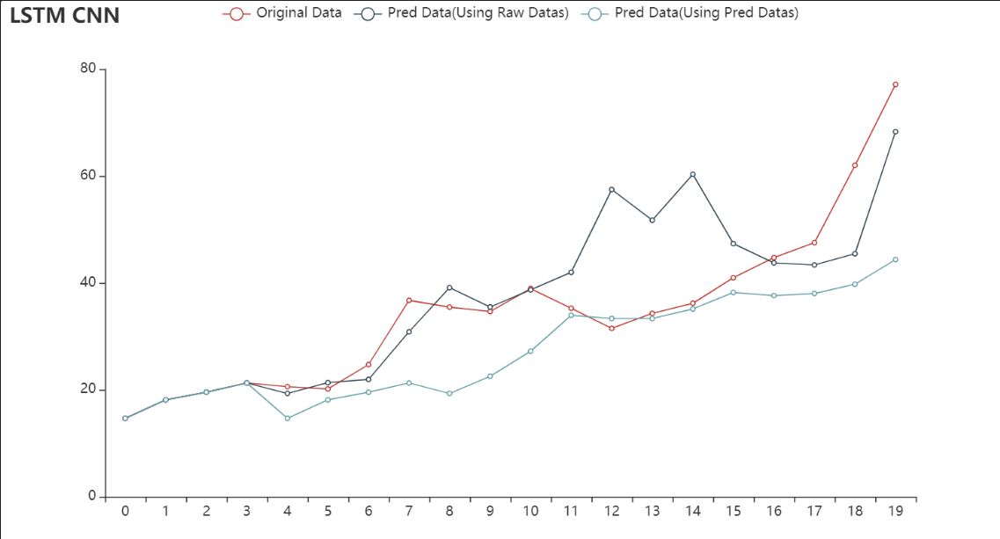

<center><b>窗口大小为4</b></center>

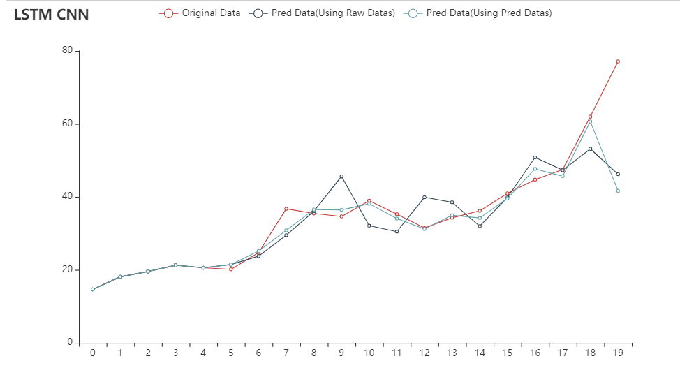

<center><b>窗口大小为5</b></center>

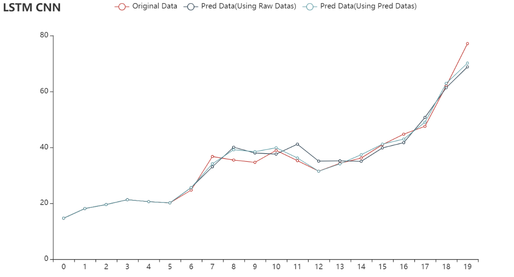

<center><b>窗口大小为6</center>

从结果上来看，在一定范围内，时间窗口越大，损失误差越小。

至于验证，我们可以选`Rice`做验证：

```py
x=torch.FloatTensor(pp_c[pp_c['Item']=="Rice"]['Value'].tolist())
pre,ppre=[i.item() for i in x[:ws]],[]
for i in range(len(x)-ws+1):
    ppre.append(d(torch.FloatTensor(x[i:i+ws]).unsqueeze(dim=0)))
    pre.append(d(torch.FloatTensor(pre[-ws:]).unsqueeze(dim=0)).item())
l=Line()
l.add_xaxis([i for i in range(len(x))])
l.add_yaxis("Original Data",x.tolist())
l.add_yaxis("Pred Data(Using Raw Datas)",x[:ws].tolist()+[i.item() for i in ppre])
l.add_yaxis("Pred Data(Using Pred Datas)",pre)
l.set_series_opts(label_opts=opts.LabelOpts(is_show=False))
l.set_global_opts(title_opts=opts.TitleOpts(title='LSTM CNN'))

l.render_notebook()
```


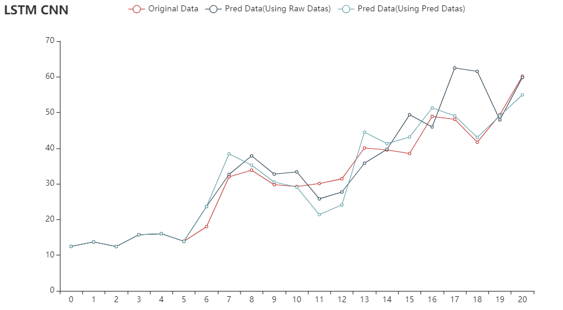

<center>基于Rice数据的验证结果


可以发现，用预测做预测的结果，基本上不会差太多，那也就意味着，我们可以对高粱进行预测。不过在这之前，我们可以看看用原始数据做训练的结果：

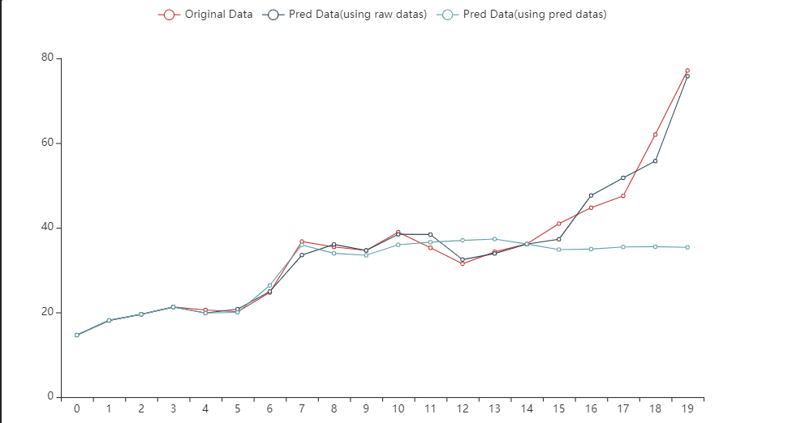

<center> 采用原始数据作训练的结果


时间窗口一样为6，可以看到在黑线贴合的非常好，但是面对大量缺失的数据，精度就远不如用预测数据做预测的结果了。

此外，这是用CNN做的结果

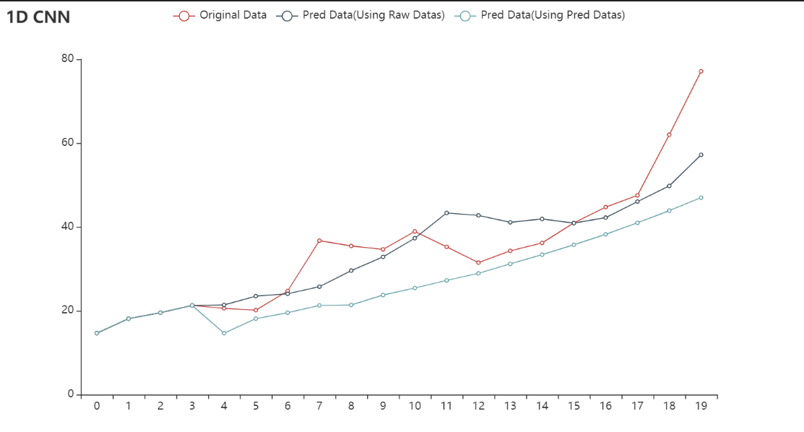

<center> CNN拟合结果


我们可以发现LSTM的波动要比CNN好，CNN后面死水一潭，应该是梯度消失导致的，前面信息没有了，后面信息又是自个构造的，这就导致了到后面变成了线性情况。

那么最后的最后，就是预测高粱产量了：

```py
pre_data=pp_c[pp_c['Item']=='Sorghum']['Value'].tolist()
l=pre_data[:]
for i in range(len(x)-ws+1):
    l.append(d(torch.FloatTensor(l[-ws:]).unsqueeze(dim=0)).item())
L=Line()
L.add_xaxis([i for i in range(len(x))])
L.add_yaxis("Pred",l)
L.set_series_opts(label_opts=opts.LabelOpts(is_show=False))
L.set_global_opts(title_opts=opts.TitleOpts(title='sorghum production forecasts')
                            
                             )

L.render_notebook()
l.to_csv("path")
```

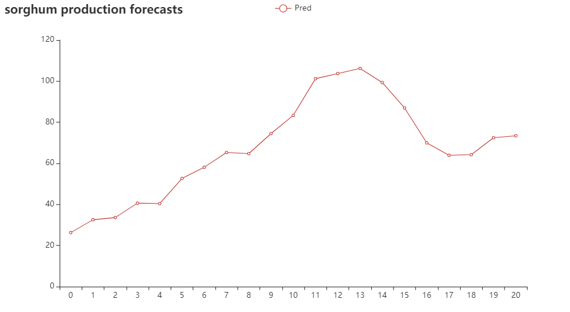

<center> 高粱价格拟合曲线


将结果数据更新。

```python
for i in range(1,len(x)-ws):
	pp_c=pp_c.append({"Unnamed: 0":91+i,"Year":2006+i,"Value":l[5+i],"Item":"Sorghum",'Unit':"卢比/kg"},ignore_index=True)
```

---

### 3.3 斯里兰卡总ESV计算

对于我们前面得到的数据，依据价值公式计算生态服务单位价值表。

```python
y=pd.read_excel(path+r"\yield_final.xlsx")
p=pd.read_excel(path+r"\Price_Mean.xls")

s=0
for _ in y["Item"].unique():
    s+=y[y['Item']==_]['Value'].tolist()[0]*p[p['Item']==_]["Price"].tolist()[0]
s/=4*7
```

可以得到这样一个因子：

```python
s:16111.103594750322
```

该因子表示每公顷的价值。接下来，我们读取生态系统服务价值表，该表根据本项目的类型做过修改。即：保留存在的类型，剔除不存在的类型，将森林因子记作针叶林、阔叶林、针阔混交林的平均值。

```python
e=pd.read_excel(path+r"/Esv_table.xls")
```

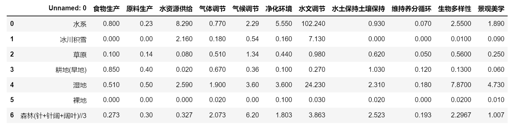

<center>改进标准价值当量


```python
for i in e.columns:
    if e[i].dtype ==np.float64:
        e[i]=e[i]*16111 # 不保留小数部分了
```

于是，可以得到我们的最终结果表。

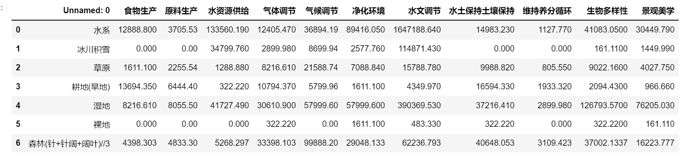

<center> 价值当量


将每年的土地覆盖属性表导出，接着将利用这些数据计算最终结果。

```python
path=r"E:\Sri Lanka\attributeTable"

values=r"E:\Sri Lanka\ESV_Pro.csv"  # 这个就是上面那张表的导出

mapTable={
    1:"水系",
    2:"森林(针+针阔+阔叶)//3",
    4:"湿地",
    5:"耕地(旱地)",
    7:"城镇用地",
    8:"裸地",
    9:"冰川积雪",
    10:"云层",
    11:"草原"
}

from collections import defaultdict


AT=[]
tab=os.listdir(path)
tables=[i for i in tab if i.endswith("t.csv")]
# ['2017t.csv', '2018t.csv', '2019t.csv', '2020t.csv', '2021t.csv', '2022t.csv']
for i in range(len(tables)):
    newT=defaultdict(int)
    year=tables[i].split('.')[0]
    tb=pd.read_csv(os.path.join(path,tables[i]))
    for i in range(len(tb)):
        if (k:=mapTable[tb["Value"][i]]) in v["Unnamed: 0"].unique():
            _=tb['Count'][i]/100
            for n,g in enumerate(v.columns[2:].tolist(),2):
                  # 每一项都等于 每种类型的像元乘以该像元在该项之下的价值之和
                newT[g]+=_/1e10*v[v["Unnamed: 0"]==k].iloc[0,n]
    AT.append(newT)
d=pd.DataFrame(AT,index=["%s"%i for i in range(2017,2023)])
```

其结果如下：

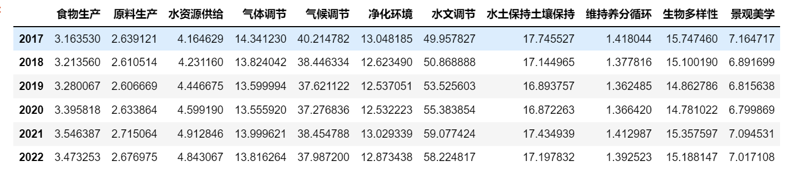

<center> 分项ESV量表


其中，食物生产、原料生产、水资源供给属于`供给服务`，气体调节、气候调节、净化环境、水文调节属于`调节服务`，水土保持、养分循环、生物多样性属于`支持服务`，美学景观属于`文化服务`。

```python
newD=pd.DataFrame([],columns=["供给服务","调节服务","支持服务","文化服务"])
newD["供给服务"]=d.iloc[:,0]+d.iloc[:,1]+d.iloc[:,2]
x=d.iloc[:,3]
for i in range(4,7):
    x+=d.iloc[:,i]
newD["调节服务"]=x
x=d.iloc[:,7]
for i in range(8,10):
    x+=d.iloc[:,i]
newD['支持服务']=x
newD['文化服务']=d.iloc[:,-1]
```

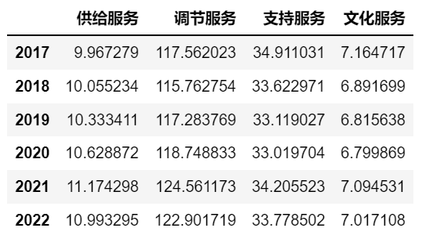

<center>大类ESV量表


剩下的工作就是绘制图表了。

---

### 3.4 斯里兰卡行政县ESV变化情况

在本部分中，我们将研究分析2017-2022年斯里兰卡各个行政县的ESV变化，并通过人为设置分级，对其总量进行量化。其计算公式如下：

| 值(单位：10亿/卢比) | 级别 |
| :-----------------: | :--: |
|         0-3         |  低  |
|         3-6         | 较低 |
|         6-9         | 中等 |
|        9-12         | 较高 |
|         >12         |  高  |

为了能够实现按照各个省份分级，需将原本的土地覆盖栅格数据按照县面多边形进行裁剪，创建独立的县单元栅格，方便我们进行处理。当然，如果只是想做简单的聚合，则不需要进行独立栅格的构建，直接使用`分区统计`工具即可。

斯里兰卡有二十五个行政县，如果一个个用手点的话，是不是有些麻烦了，批处理也不支持迭代处理要素，那么有没有什么更加便捷的自动化操作呢？一开始我想的是用脚本来做，但是看到ArcGIS里面有一个模型构建器。通过模型构建器，可以创建迭代工作流，进而实现我们的需求。

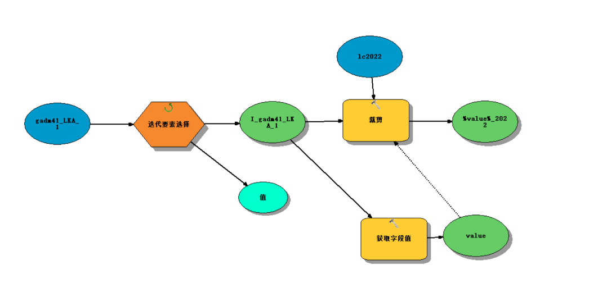

<center> 裁剪模型迭代器


对行政区矢量数据内的所有面要素进行迭代，并将其作为裁剪工具的输入面要素，即可实现端到端的一键式任务流。将拆分数据的工作空间设置为一个新的`mdb`文件，即可获得分割好的数据。

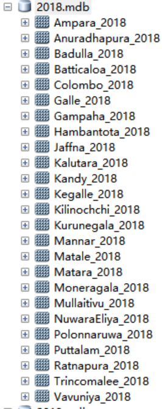

<center> 迭代结果


由于分割的栅格没有属性表，此时我们需要迭代对其构建属性表。同样，可以使用模型构建器来进行，亦或是通过属性->符号系统来构建属性表。再拿到属性表之后，我们的数据应该是这样的：

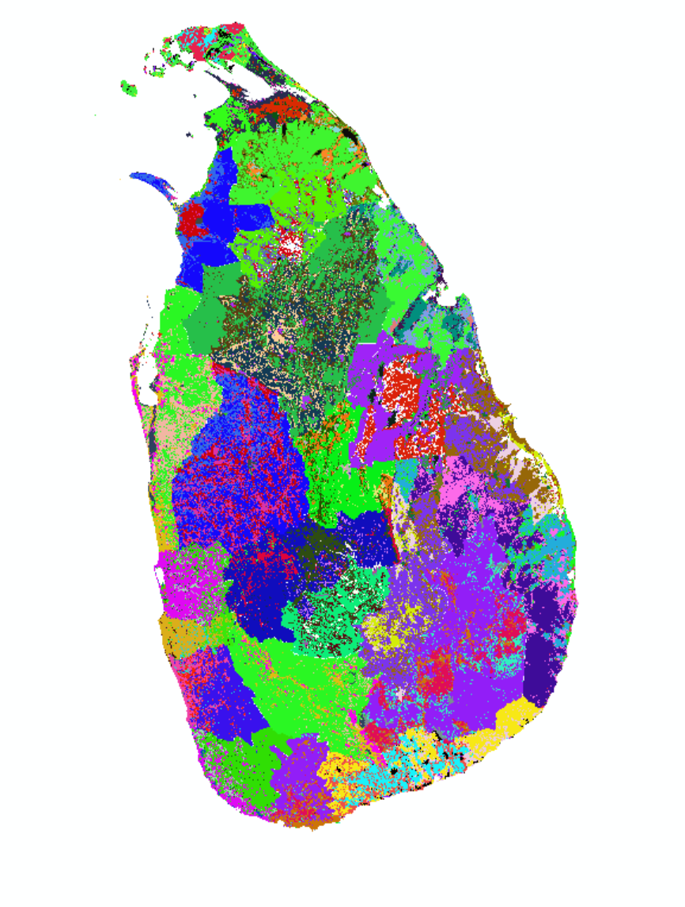

<center> 地图效果


颜色斑杂是因为每个独立区块使用的色彩分级不一样，但这并不是我们要关注的重点。下一步操作将会导出这些属性表，并进行可视化。同样使用模型构建器，可以导出属性表：

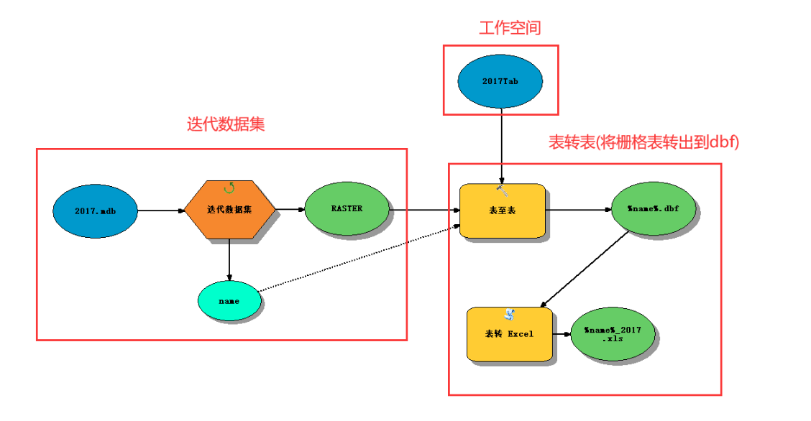

<center> 属性表导出迭代器


`表转Excel`位于转换工具->Excel->表转Excel。

`表至表`位于转换工具->转出至地理数据库->表至表。

该操作后，我们便可取到对应栅格数据的数据表。下一步的工作内容是对这些表格进行处理，计算ESV价值。

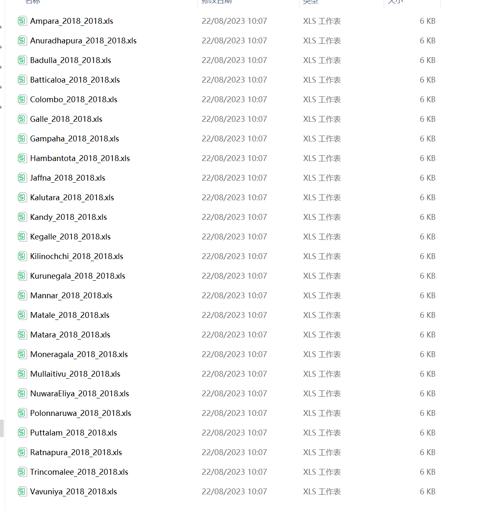

<center> 导出结果


实际上，这个属性表长这个样子：

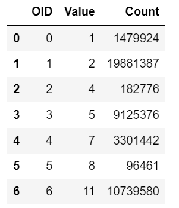

<center> 属性表


需要关注的就是`Value`属性和`Count`属性，前者代表土地覆盖类型，我们通过一个映射函数将映射到实际含义上，后者表示像元个数，注意像元大小是`10m by 10m`，如果换算成公顷，需要除以100。

```python
path=r"E:\Sri Lanka\SubDivision" # 文件路径
mapTable={
    1:"水系",
    2:"森林(针+针阔+阔叶)//3",
    4:"湿地",
    5:"耕地(旱地)",
    7:"城镇用地",
    8:"裸地",
    9:"冰川积雪",
    10:"云层",
    11:"草原"
} # 映射表

values=r"E:\Sri Lanka\ESV_Pro.csv" # 前面得到的最终因子价值
v=pd.read_csv(values)
v.drop(v.columns[0],axis=1,inplace=True)


def getValue(year):
    def f(tem):
        Sum=0
        for i in range(len(tem)):
            # 若映射存在
            if(k:=mapTable[tem['Value'][i]]) in v['Unnamed: 0'].unique():
                _=tem['Count'][i]/100 # 换算成公顷
                Sum+=v[v['Unnamed: 0']==k].iloc[0,1:].sum()*_ # 总价值=\sum c_i*v_i
        return Sum
    dicT=defaultdict(int)
    tabs=os.listdir(path+r"\%sTabs"%year)
    total_esv=0
    for i in tabs:
        tb=pd.read_excel(path+r"\%sTabs\\"%year+i)
        total_esv+=(k:=f(tb))
        dicT[i.split("_")[0]]=k/1e10
    return total_esv/1e10,dicT
```

为了验证该函数，我们可以尝试读取一下数据：

```python
getValue(2017)[0] # 获取2017年全国总量
```

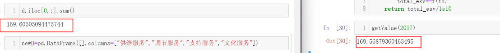

<center> 结果比对


从结果上，与前面未做分割的全国数据大致相等。由于按照多边形分割不可避免的会造成像元损失，因此该结果会小于整体的结果，误差在可接受范围内。

下一步，需要计算各个县每年的总量。

```python
Stable=[getValue(i) for i in range(2017,2023)]
DataShow=pd.DataFrame([],columns=[str(i) for i in range(2017,2023)])
# 实际上，DF可以直接传入一个Dict，Key将作为Index，value将作为列值
for i in range(2017,2023):DataShow[str(i)]=Stable[i-2017][1]
```

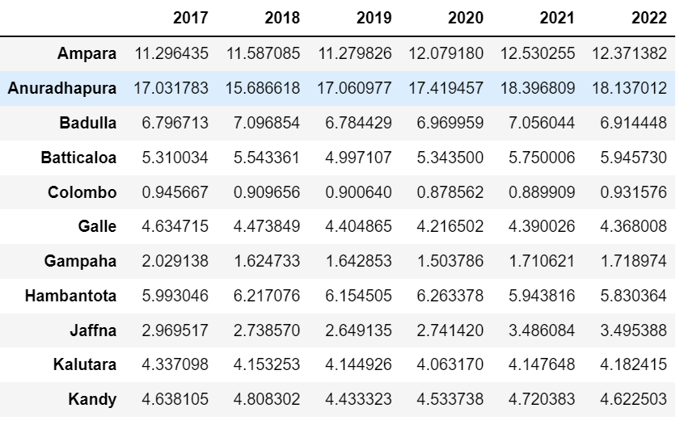

<center> 各县市年总ESV量表


我们将这个结果表导出，下一步便是在ArcGIS中绘制地图。

通过属性表的连接操作，可以将导出的表添加到矢量图中，然后就是对其进行地图制作，这方面不再赘述。

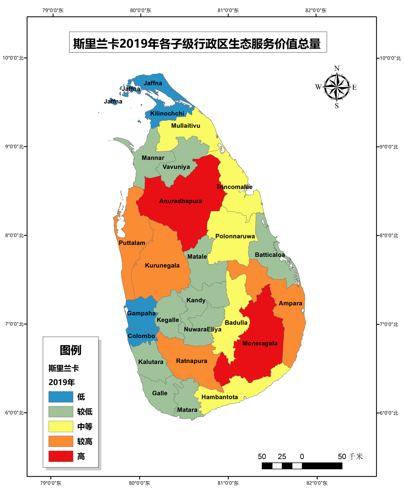

<center> 制图结果


再进一步，我们将利用`imageio`模块绘制动态图。

```python
import imageio
def create_gif(filelist,name,dur=1.5):
    IMG=[]
    for i in filelist:
        IMG.append(imageio.imread(i))
    return imageio.mimsave(name,IMG,'GIF',duration=dur)
path=[os.path.join(r"E:\Sri Lanka\Res\Img",i) for i in os.listdir(r"E:\Sri Lanka\Res\Img")]
create_gif(path,r"E:\Sri Lanka\Res\Img\res.gif")
```

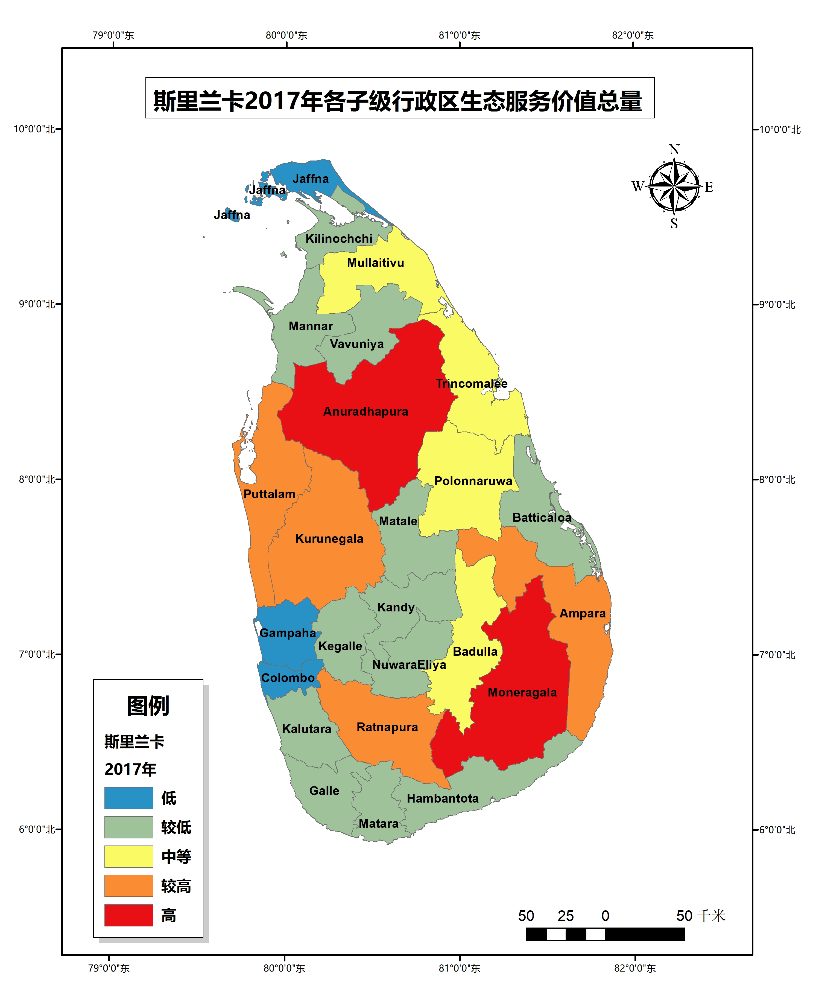

<center> 各省ESV年变化情况


结果如上图所示。

---

## 四、结果展示

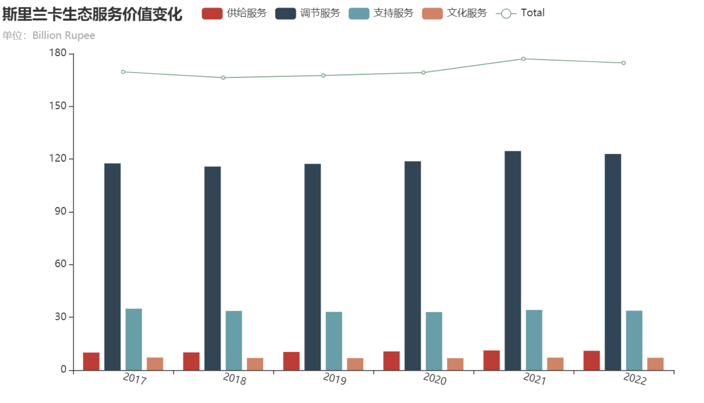

<center> 斯里兰卡生态系统服务价值变化表


在斯里兰卡生态系统服务中，调节服务占了较大的比重，而文化服务的价值量较低，这与斯里兰卡大量的森林植被、湿地草甸覆盖有关。总体的价值量呈现波动上升趋势，说明斯里兰卡在新型人地关系的构建与维护上成果斐然。

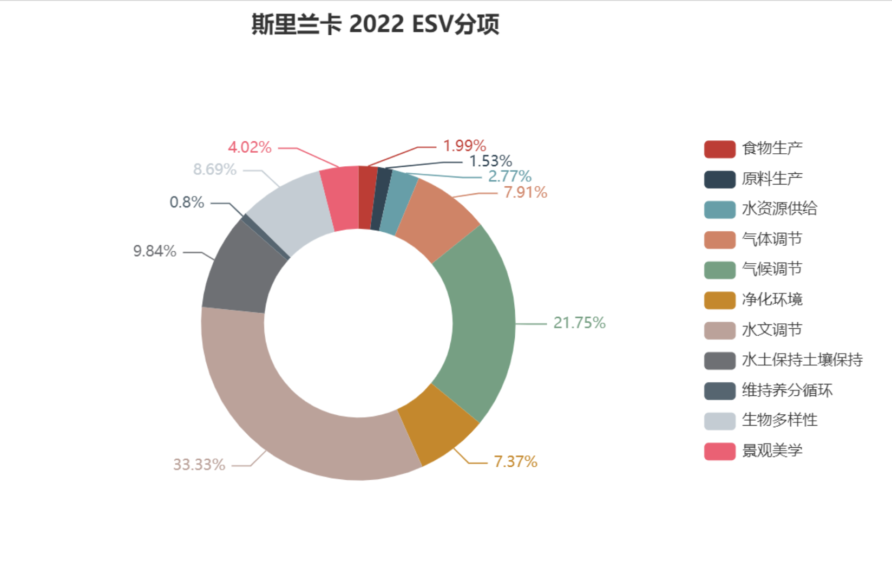

<center> 斯里兰卡2022ESV分项占比


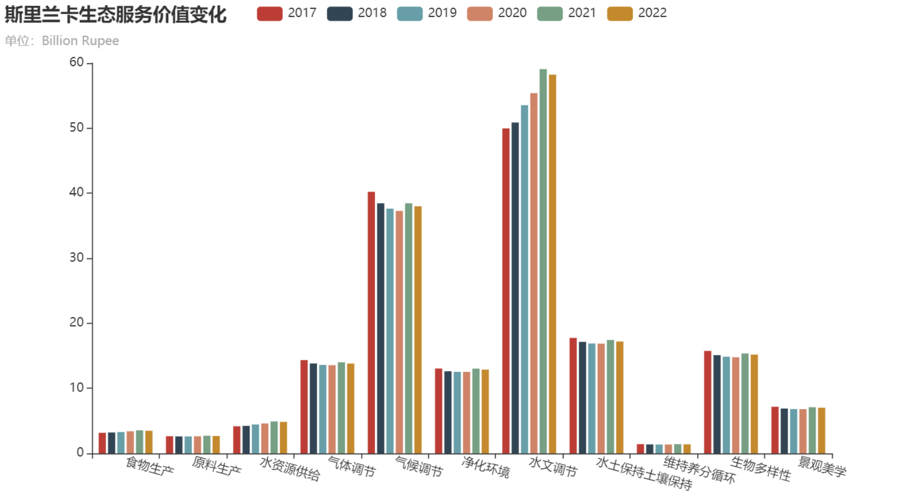

<center>各分项年变化情况


从各省结果来看，斯里兰卡的中部和东部具有较高的价值量，且随着时间变化，东部、中部地区总量呈现增加趋势，而`Matara`和`Puttalam`两个省份则是刚好在分界线上呈现先下降后上升的结果。

---

## 五、参考文献

熊睿毅. 福建省生态系统服务价值动态评估及影响因子研究[D].武汉大学,2021.DOI:10.27379/d.cnki.gwhdu.2021.000700.